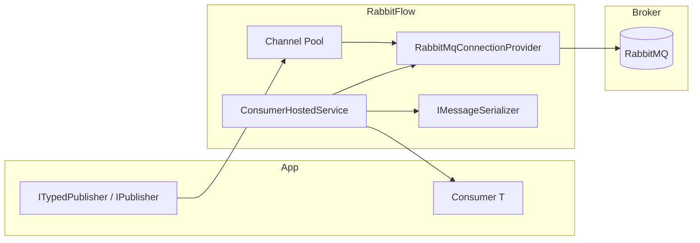

# RabbitFlow

[](https://www.nuget.org/packages/RabbitFlow/)
[](https://www.nuget.org/packages/RabbitFlow/)

A .NET library that abstracts the RabbitMQ client with dependency injection, async APIs, and a fluent API for publishing and consuming messages.

## Features

- **Dependency injection** — native integration with `Microsoft.Extensions.DependencyInjection`
- **Performance** — singleton connection, channel pool for publishing, and dedicated channels for consumers
- **Extensible** — swap the serializer, add custom topologies, or use `IPublisher` directly
- **Resilient** — automatic connection recovery, manual ack/nack, and configurable prefetch
- **Async-first** — built on [RabbitMQ.Client 7.x](https://www.rabbitmq.com/client-libraries/dotnet-api-guide)

## Repository structure

```
RabbitFlow/
├── RabbitFlow/                        # Main library
│   ├── Abstractions/                  # Contracts (IPublisher, IConsumer, etc.)
│   ├── Configuration/                 # Options pattern
│   ├── Connection/                    # Connection and channel pool
│   ├── Publishing/                    # Message publishing
│   ├── Consuming/                     # Consumption via IHostedService
│   ├── Serialization/                 # JSON serialization (default)
│   ├── Topology/                      # Exchange, queue, and binding declaration
│   └── DependencyInjection/           # AddRabbitFlow() and RabbitFlowBuilder
├── samples/
│   ├── RabbitFlow.Samples.Contracts/  # Shared contracts
│   ├── RabbitFlow.Sample.Publisher/     # Publisher example
│   └── RabbitFlow.Sample.Consumer/      # Consumer example
├── tests/
│   └── RabbitFlow.Tests/              # Unit tests (xUnit + Moq)
├── docs/
│   └── PUBLISHING.md                  # NuGet publishing guide
├── scripts/
│   ├── pack.sh                        # Pack the NuGet package
│   └── publish.sh                     # Publish to NuGet.org
├── .github/workflows/
│   └── release-nuget.yml              # Release CI workflow
├── CHANGELOG.md
├── LICENSE
└── docker-compose.yml                 # Local RabbitMQ for testing
```

## Requirements

- [.NET 10 SDK](https://dotnet.microsoft.com/download)
- RabbitMQ (local via Docker or a remote instance)

## Quick start

### 1. Start RabbitMQ

```bash
docker compose up -d
```

The management UI will be available at [http://localhost:15672](http://localhost:15672) (`guest` / `guest`).

### 2. Run the samples

In one terminal, start the **consumer**:

```bash
dotnet run --project samples/RabbitFlow.Sample.Consumer
```

In another terminal, start the **publisher**:

```bash
dotnet run --project samples/RabbitFlow.Sample.Publisher
```

The publisher sends an order every 3 seconds. The consumer receives it and logs:

```
info: RabbitFlow.Sample.Consumer.OrderCreatedConsumer[0]
      Received order a1b2c3d4-... from Jane Doe — total $250.00
```

## Installation

### Via NuGet (recommended)

Install the package in your application project (Worker, Web API, console app with `IHost`, etc.):

```bash
dotnet add package RabbitFlow
```

For applications that consume messages, also add hosting (required for `ConsumerHostedService`):

```bash
dotnet add package Microsoft.Extensions.Hosting
```

**Package Manager Console (Visual Studio):**

```powershell
Install-Package RabbitFlow
Install-Package Microsoft.Extensions.Hosting
```

**Direct PackageReference in `.csproj`:**

```xml
<ItemGroup>
  <PackageReference Include="RabbitFlow" Version="1.0.0" />
  <PackageReference Include="Microsoft.Extensions.Hosting" Version="10.0.8" />
</ItemGroup>
```

> The `RabbitFlow` package already includes `RabbitMQ.Client`, `Microsoft.Extensions.DependencyInjection.Abstractions`, `Microsoft.Extensions.Hosting.Abstractions`, `Microsoft.Extensions.Options`, and `Microsoft.Extensions.Logging.Abstractions`.

### Via project reference (local development)

If you are working from this repository:

```xml
<ProjectReference Include="path/to/RabbitFlow/RabbitFlow.csproj" />
```

### Publishing to NuGet.org

See the full guide at [`docs/PUBLISHING.md`](docs/PUBLISHING.md).

```bash
# Pack (tests + .nupkg + .snupkg in ./artifacts)
chmod +x scripts/pack.sh && ./scripts/pack.sh

# Publish (requires NUGET_API_KEY)
export NUGET_API_KEY="your-api-key"
chmod +x scripts/publish.sh && ./scripts/publish.sh
```

Test the package locally before publishing:

```bash
./scripts/pack.sh
dotnet add package RabbitFlow --source ./artifacts
```

## Usage in a new project

### 1. Configuration (`appsettings.json`)

```json
{
  "RabbitFlow": {
    "HostName": "localhost",
    "Port": 5672,
    "UserName": "guest",
    "Password": "guest",
    "VirtualHost": "/"
  }
}
```

### 2. Worker with publisher

```csharp
using RabbitFlow.Abstractions;
using RabbitFlow.DependencyInjection;

var builder = Host.CreateApplicationBuilder(args);

builder.Services.AddRabbitFlow(options =>
{
    options.HostName = builder.Configuration["RabbitFlow:HostName"] ?? "localhost";
    options.Port = builder.Configuration.GetValue("RabbitFlow:Port", 5672);
    options.UserName = builder.Configuration["RabbitFlow:UserName"] ?? "guest";
    options.Password = builder.Configuration["RabbitFlow:Password"] ?? "guest";
    options.VirtualHost = builder.Configuration["RabbitFlow:VirtualHost"] ?? "/";
})
.AddPublisher<OrderCreatedEvent>(publish =>
{
    publish.Exchange = "orders";
    publish.RoutingKey = "order.created";
});

builder.Services.AddHostedService<OrderPublisherWorker>();

await builder.Build().RunAsync();

// Inject ITypedPublisher<OrderCreatedEvent> into your worker or service
public sealed class OrderPublisherWorker(ITypedPublisher<OrderCreatedEvent> publisher) : BackgroundService
{
    protected override async Task ExecuteAsync(CancellationToken stoppingToken)
    {
        await publisher.PublishAsync(
            new OrderCreatedEvent(Guid.NewGuid(), "Jane Doe", 199.90m),
            cancellationToken: stoppingToken);
    }
}

public sealed record OrderCreatedEvent(Guid OrderId, string CustomerName, decimal Total);
```

### 3. Worker with consumer

```csharp
using RabbitFlow.DependencyInjection;
using RabbitFlow.Messaging;

var builder = Host.CreateApplicationBuilder(args);

builder.Services.AddRabbitFlow(options =>
{
    options.HostName = builder.Configuration["RabbitFlow:HostName"] ?? "localhost";
    options.UserName = builder.Configuration["RabbitFlow:UserName"] ?? "guest";
    options.Password = builder.Configuration["RabbitFlow:Password"] ?? "guest";
})
.AddConsumer<OrderCreatedConsumer, OrderCreatedEvent>(consume =>
{
    consume.Queue = "orders.created";
    consume.Exchange = "orders";
    consume.BindingRoutingKey = "order.created";
    consume.PrefetchCount = 10;
});

await builder.Build().RunAsync();

public sealed class OrderCreatedConsumer(ILogger<OrderCreatedConsumer> logger)
    : Consumer<OrderCreatedEvent>
{
    public override Task ConsumeAsync(OrderCreatedEvent message, CancellationToken cancellationToken = default)
    {
        logger.LogInformation("Order {OrderId} received", message.OrderId);
        return Task.CompletedTask;
    }
}
```

### 4. ASP.NET Core (publish only)

For APIs that only publish messages, register `AddRabbitFlow` in `Program.cs` and inject `ITypedPublisher<T>` into your endpoints or services. No extra `Microsoft.Extensions.Hosting` package is needed beyond what ASP.NET Core already provides.

```csharp
var builder = WebApplication.CreateBuilder(args);

builder.Services.AddRabbitFlow(options =>
{
    options.HostName = builder.Configuration["RabbitFlow:HostName"]!;
})
.AddPublisher<OrderCreatedEvent>(publish =>
{
    publish.Exchange = "orders";
    publish.RoutingKey = "order.created";
});

var app = builder.Build();

app.MapPost("/orders", async (OrderCreatedEvent order, ITypedPublisher<OrderCreatedEvent> publisher) =>
{
    await publisher.PublishAsync(order);
    return Results.Accepted();
});

app.Run();
```

## Configuration

### Basic registration

```csharp
using RabbitFlow.DependencyInjection;

builder.Services.AddRabbitFlow(options =>
{
    options.HostName = "localhost";
    options.Port = 5672;
    options.UserName = "guest";
    options.Password = "guest";
    options.VirtualHost = "/";
    options.ChannelPoolSize = 16;
    options.AutomaticRecoveryEnabled = true;
});
```

### Binding via `IConfiguration`

```csharp
using RabbitFlow.Configuration;

builder.Services.AddRabbitFlow();
builder.Services.Configure<RabbitFlowOptions>(
    builder.Configuration.GetSection(RabbitFlowOptions.SectionName));
```

Add the `RabbitFlow` section to `appsettings.json` (see example above).

### Available options (`RabbitFlowOptions`)

| Property | Default | Description |
|---|---|---|
| `HostName` | `localhost` | Broker host |
| `Port` | `5672` | AMQP port |
| `UserName` / `Password` | `guest` | Credentials |
| `VirtualHost` | `/` | Virtual host |
| `ClientProvidedName` | `RabbitFlow` | Connection name on the broker |
| `ChannelPoolSize` | `16` | Channel pool size for publishing |
| `AutomaticRecoveryEnabled` | `true` | Automatic connection recovery |
| `TopologyRecoveryEnabled` | `true` | Topology recovery |
| `ConnectionRecoveryInterval` | `10s` | Interval between reconnection attempts |

## Publishing

### Typed publisher (recommended)

Register the endpoint with exchange and routing key:

```csharp
builder.Services.AddRabbitFlow(/* ... */)
    .AddPublisher<OrderCreatedEvent>(publish =>
    {
        publish.Exchange = "orders";
        publish.RoutingKey = "order.created";
        publish.Persistent = true;
    });
```

Inject `ITypedPublisher<T>` into your service:

```csharp
public class OrderService(ITypedPublisher<OrderCreatedEvent> publisher)
{
    public Task CreateOrderAsync(OrderCreatedEvent order) =>
        publisher.PublishAsync(order);
}
```

### Generic publisher

Use `IPublisher` when you need dynamic exchange/routing key values:

```csharp
await publisher.PublishAsync(
    message,
    exchange: "orders",
    routingKey: "order.created");
```

### Publish context

```csharp
await publisher.PublishAsync(order, new PublishContext
{
    CorrelationId = activityId,
    MessageId = Guid.NewGuid().ToString("N"),
    Persistent = true,
    Headers = new Dictionary<string, object?> { ["source"] = "api" }
});
```

## Consuming

### Class-based consumer

```csharp
public sealed class OrderCreatedConsumer : Consumer<OrderCreatedEvent>
{
    public override Task ConsumeAsync(
        OrderCreatedEvent message,
        CancellationToken cancellationToken = default)
    {
        // process message
        return Task.CompletedTask;
    }
}
```

### Consumer registration

```csharp
builder.Services.AddRabbitFlow(/* ... */)
    .AddConsumer<OrderCreatedConsumer, OrderCreatedEvent>(consume =>
    {
        consume.Queue = "orders.created";
        consume.Exchange = "orders";
        consume.BindingRoutingKey = "order.created";
        consume.PrefetchCount = 10;
        consume.DurableQueue = true;
    });
```

`ConsumerHostedService` automatically starts all registered consumers as an `IHostedService`.

### Consume options (`ConsumeOptions`)

| Property | Default | Description |
|---|---|---|
| `Queue` | — | Queue name (required) |
| `Exchange` | `null` | Exchange for binding |
| `BindingRoutingKey` | `null` | Binding routing key |
| `PrefetchCount` | `10` | Prefetched messages per consumer |
| `AutoAck` | `false` | Automatic ack (disabled by default) |
| `DurableQueue` | `true` | Durable queue |

## Extensibility

### Custom serializer

Implement `IMessageSerializer` and register it on the builder:

```csharp
builder.AddSerializer<MyProtobufSerializer>();
```

### Custom topology

Implement `IRabbitMqTopology` to declare additional resources:

```csharp
public class DeadLetterTopology : IRabbitMqTopology
{
    public Task DeclareAsync(IChannel channel, CancellationToken cancellationToken = default)
    {
        // declare DLQ, exchanges, etc.
        return Task.CompletedTask;
    }
}

builder.AddTopology<DeadLetterTopology>();
```

## Internal architecture



- **Publishing** — rents a channel from the pool, publishes, and returns it
- **Consuming** — each consumer gets a long-lived dedicated channel
- **Topology** — exchanges, queues, and bindings are declared on startup
- **Serialization** — JSON via `System.Text.Json` by default (camelCase)

## Error handling

With `AutoAck = false` (default), messages that fail processing receive a **nack with requeue**. Errors are logged via `ILogger`. For dead-letter queues, implement a custom topology with `IRabbitMqTopology`.

## Tests

The project includes unit tests with **xUnit**, **Moq**, and **Coverlet** in `tests/RabbitFlow.Tests`.

```bash
# Run tests
dotnet test

# Run with coverage (80% minimum configured in the csproj)
dotnet test tests/RabbitFlow.Tests/RabbitFlow.Tests.csproj \
  /p:CollectCoverage=true \
  /p:CoverletOutputFormat=cobertura \
  /p:Threshold=80 \
  /p:ThresholdType=line
```

Current coverage:

| Metric | Coverage |
|--------|----------|
| Lines | ~94% |
| Branches | ~82% |
| Methods | 100% |

Covered areas: serialization, topology, publishing, channel pool, connection, DI, consumers, and host lifecycle.

## Build

```bash
dotnet build
```

## License

MIT
